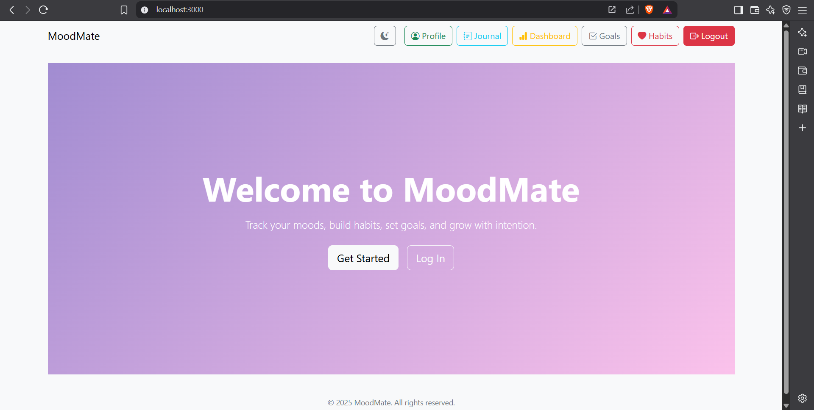

# MoodMate

**MoodMate** is a comprehensive mental wellness application designed to help users track their mood, manage their habits, journal their thoughts, and set meaningful goals. Built with a modern stack (Express.js for the backend, React for the frontend, and MongoDB as the database), this app offers an intuitive interface and useful features aimed at improving mental health.

---

## Features

- **Mood Dashboard**: Track your daily mood with visual charts.
- **Journal**: Write, store, and view your journal entries.
- **Goal Tracker**: Set and manage your goals with progress tracking.
- **Habit Tracker**: Build and track habits that help improve your well-being.
- **User Authentication**: Secure login and registration system.
- **Dark Mode**: Toggle between light and dark themes for personalized comfort.

---

## Screenshots



---

## Technologies Used

- **Frontend**: React.js, React Router, Axios for API requests
- **Backend**: Express.js, MongoDB for database
- **Authentication**: JWT & cookie-based authentication
- **Styling**: Bootstrap, Custom CSS
- **Mood Tracking**: Custom progress indicators

---

## Setup

### Prerequisites

Before you begin, ensure you have the following installed on your local machine:

- [Node.js](https://nodejs.org/)
- [MongoDB](https://www.mongodb.com/try/download/community) (or use MongoDB Atlas)
- [npm](https://www.npmjs.com/)

---

### Running Locally

To get the project running locally, follow these steps:

1. **Clone the repository**:

    ```bash
    git clone https://github.com/anatole0000/moodmate.git
    cd express-project
    ```

2. **Install Backend Dependencies**:

    Navigate to the backend folder and install dependencies:

    ```bash
    cd backend
    npm install
    ```

3. **Start the Backend**:

    Start the Express server:

    ```bash
    npm start
    ```

4. **Install Frontend Dependencies**:

    Navigate to the frontend folder and install dependencies:

    ```bash
    cd frontend
    npm install
    ```

5. **Start the Frontend**:

    Start the React app:

    ```bash
    npm run dev
    ```

6. **Navigate to** `http://localhost:3000` in your browser to access the app.

---

## Folder Structure

